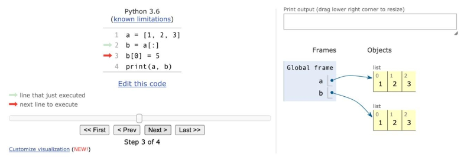
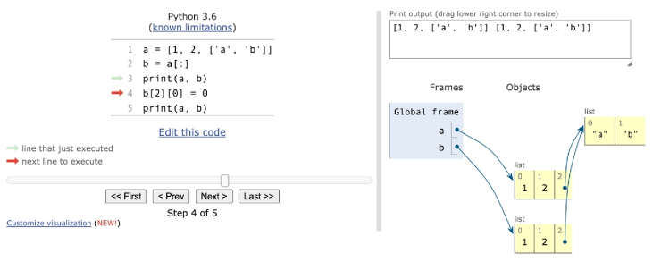
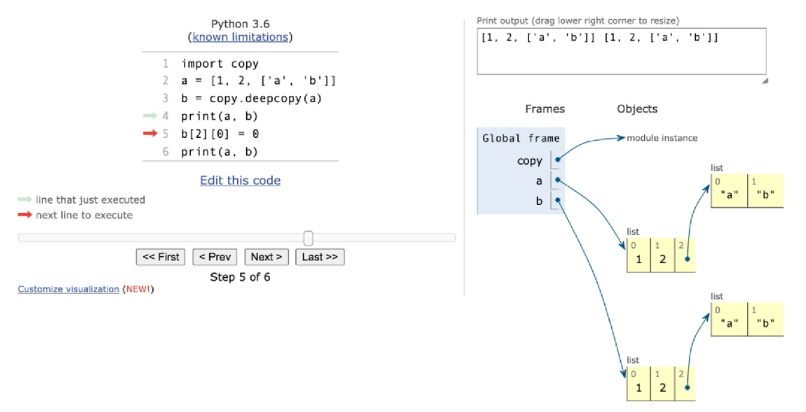

# 데이터 구조

---

---

## 데이터 구조 활용

- 데이터 구조를 활용하기 위해서는 메서드(method)를 활용
  
  - 메서드는 클래스 내부에 정의한 함수, 사실상 함수 동일
    - 함수와 메서드의 차이
      - 함수(모든 자료형에서 사용할 수 있음) sum len in
      - 메서드(특정 자료형에서 사용할 수 있음) l.append()

- 객체의 기능
  
  - **데이터 구조.메서드()**
      list.append(10)

----

## 파이썬 공식 문서의 표기법

- python 구문이 아니며, 문법을 표기하기 위한 것임
- ```python
  str.replace(old, new[,count])
  ```
  - old, new는 필수/ [,count]는 선택적 인자 의미

----

---

# *mutable 과 immutable*

*오늘의 내용들을 관통하는 개념!!!*

- mutable : list, dict

- immutable : int, float, str, tuple

---

---

# 순서가 있는 문자열

- 문자열

- 리스트

- 튜플

---

## 문자열

- 문자들의 나열(sequence of characters)
  
  - 모든 문자는 str 타입(immutable)
  - ```python
    word = 'hello'
    print(id(word)) # 메모리 주소(사물함 번호 같은 것이라고 생각하면 됨!)
    ```

- 문자열은 작은 따옴표(')나 큰 따옴표(")를 활용하여 표기
  
  - 문자열을 묶을 때 동일한 문장부호를 활용
  
  - PEP8에서는 소스코드 내에서 하나의 문장부호를 선택하여 유지하도록 함
    
    - 문자열을 표현할 때 작은 따옴표를 사용하고 싶다면 이후 모든 문자열을 작은 따옴표로 쭉 작성하는 것!

---- 

### 문자열 조회/탐색 및 변경 메서드

##### 문자열 조회/탐색

- s.find(x)
  
  - x의 첫 번재 위치를 반환, 없으면 -1을 반환
    
    - (*오류가 안남* -> 프로그램 진행이 된다는 뜻)

- s.index(x)
  
  - x의 첫 번째 위치를 반환, 없으면 오류 발생(프로그램이 멈춘다는 뜻)

- s.isalpha()
  
  - 알파벳 문자 여부
    
    - 단순 알파벳이 아닌 유티코드 상 letter(한국어도 포함)

- s.isupper()
  
  - 대문자 여부

- s.islower()
  
  - 소문자 여부

- s.istitle()
  
  - 타이틀 형식 여부

#### 문자열 변경 메서드

- s.replace(old, new[,count])
  
  - 바꿀 대상 글자를 새로운 글자로 바꿔서 반환
  
  - count를 지정하면, 해당 개수만큼만 시행

- s.strip([chars])
  
  - 특정 문자를 지정하면,
    
    - 양쪽을 제거하거나(strip), 왼쪽을 제거하거나(lstrip), 오른쪽을 제거(rstrip)
  
  - 문자열을 지정하지 않으면 공백을 제거함

- s.split(sep=None, maxsplit =-1)
  
  - 문자열을 특정한 단위로 나눠 리스트로 반환
    
    - sep이 None이거나 지정되지 않으면 연속된 공백문자를 단일한 공백문자로 간주하고, 선행/후행 공백은 빈 문자열에 포함시키지 않음(*이해가 잘 안됨 다시 확인*)
    
    - maxsplit이 -1인 경우에는 제한이 없음

- 'separator'.json([iterable])
  
  - 반복가능한(iterable) 컨테이너 요소들을 separator(구분자)로 합쳐 문자열 반환
    
    - iterable에 문자열이 아닌 값이 있으면 TypeError 발생

-----

### *문자열은 immutable인데, 문자열 변경이 되는 이유*

- 기존의 문자열을 변경하는게 아니라, 변경된 문자열을 새롭게 만들어서 반환

---

## 리스트

### 리스트의 생성과 접근

- 리스트는 [] 혹은 list()를 통해 생성
  
  - 파이썬에는 어떠한 자료형도 저장할 수 있으며, 리스트 안에 리스트도 넣을 수 있음
  
  - 생성된 이후 내용 변경 가능 -> 가변 자료형

- 순서가 있는 시퀀스로 인덱스를 통해 접근이 가능
  
  - 값에 대한 접근은 list[i]

---

### 리스트 메서드

##### 값 추가 및 삭제

- l.append( x )
  
  - 리스트에 값을 추가함
    
    - 추가 == 덧붙인다

- l.insert( i, x )
  
  - 정해진 위치 i에 x값을 추가함

- l.extend(iterable)
  
  - 리스트에 iterable의 항목을 추가함

- l.remove( x )
  
  - 리스트에서 값이 x인 것 삭제

- l.pop( i )
  
  - 정해진 위치 i에 있는 값을 삭제하고, 그 항목을 반환함
  
  - i가 지정되지 않으면, 마짐가 항목을 삭제하고 반환함

- l.clear()
  
  - 모든 항목을 삭제함

##### 탐색 및 정렬

- l.index( x )
  
  - x값을 찾아 해당 index 값을 반환

- l.count( x )
  
  - 원하는 값의 개수를 반환함

- l.sort()
  
  - 원본 리스트를 정렬함. None 반환
  
  - sorted 함수와 비교할 것
    
    - sort() : 원본을 바꿈
    
    - sorted() : 원본은 그대로 두고 원본을 본 딴? 녀석을 정렬

- l.reverse()
  
  - 순서를 반대로 뒤집음(정렬하는 것이 아님)
    
    - 원본을 뒤집는 것

---

## 튜플

### 튜플의 정의

- 튜플은 여러 개의 값을 순서가 있는 구조로 저장하고 싶을 때 사용
  
  - 리스트와의 차이점은 생성 후, 담고 있는 값 변경이 불가 (불변 자료형)

- 항상 소괄호 형태로 사용

---

### 튜플 관련 메서드

- 튜플은 변경할 수 없기 때문에 값에 영향을 미치지 않는 메서드만을 지원

- 리스트 메서드 중 항목을 변경하는 메서드들을 제외하고 대부분 동일

---

---

# 비시퀀스형 데이터 구조

- 셋

- 딕셔너리

----

## 셋(set)

- Set이란 중복되는 요소가 없이, 순서에 상관없는 데이터들의 묶음
  
  - 데이터의 중복을 허용하지 않기 때문에 중복되는 원소가 있다면 하나만 저장
  
  - 순서가 없기 때문에 인덱스를 이용한 접근 불가능

- 수학에서의 집합을 표현한 컨테이너
  
  - 집합 연산이 가능(여집합을 표현하는 연산자는 별도로 존재 x )
  
  - 중복된 값이 존재하지 않음

- 담고 있는 요소를 삽입 변경, 삭제 가능 -> 가변 자료형(mutable)

---

### 셋 메서드

##### 추가 및 변경

- s.add(elem)
  
  - 셋에 값을 추가

- s.update(*others)
  
  - 여러 값을 추가

- s.remove(elem)
  
  - set에서 삭제하고 없으면,  KeyError

- s.discard(elem)
  
  - 셋에서 삭제하고 없어도 에러가 발생하지 않음

- s.pop()
  
  - 임의의 원소를 제거해 반환

---

## 딕셔너리(Dictionary)

### 딕셔너리 정의

- 키 - 값( key - value ) 쌍으로 이뤄진 자료형(3.7부터는 ordered, 이하 버전은 unordered)

- Dictionary 의 키(key)
  
  - key는 변경 불가능한 데이터(immutable)만 활용 가능
    
    - string, integer, float, boolean, tuple, range

- 각 키의 값(values)
  
  - 어떠한 형태든 관계없음

### 딕셔너리 메서드

##### 조회

- d.get(key[,default])
  
  - key를 통해 value를 가져옴
  
  - KeyError가 발생하지 않으며, deault 값을 설정할 수 있음(기본:None)

##### 추가 및 삭제

- d.pop(key[,default])
  
  - key가 딕셔너리에 있으면 제거하고 해당 값을 반환
  
  - 그렇지 않으면 default를 반환
  
  - default 값이 없으면 KeyError

- d.update()
  
  - 값을 제공하는 key, value로 덮어씀

---

---

# 얕은 복사와 깊은 복사

## 복사 방법

- 할당(Assignment)

- 얕은 복사(Shallow copy)

- 깊은 복사(Deep copy)

---

### 할당(Assignment)

- 대입 연산자(=)
  
  - 리스트 복사 확인하기
  
  *대입 연산자(=)를 통한 복사는 해당 객체에 대한 객체 참조를 복사(주소를 복사, 같은 주소를 쓰고있음.)*

       *해당 주소의 일부 값을 변경하는 경우 이를 참조하는 모든 변수에 영향(사물함 주소로 가서 [0]번째 값을 바꾸는거라 원본이랑 복사본 둘 다 바뀌게 됨)*

---

### 얕은 복사(Shallow copy)

- Slice 연산자 활용하여 같은 원소를 가진 리스트지만 연산된 결과를 복사 (다른 주소)
  
  ```python
  a = [ 1, 2, 3 ]
  b = a[ : ]
  
  b[0] = 5
  
  print(a, b) # [1, 2, 3] [5, 2, 3]
  ```



- 주의사항
  
  - 복사하는 리스트의 원소가 주소를 참조하는 경우
  
  ```python
  a = [1, 2, ["a", "b"]]
  b = a[:]
  
  print(a, b) # [1, 2, ["a", "b"]] [1, 2, ["a", "b"]]
  
  b[2][0] = 0
  
  print(a, b) # [1, 2, ["0", "b"]] [1, 2, ["0", "b"]]
  ```

   

---

### 깊은 복사(Deep copy)

- 리스트 복사 확인하기(주소자체도 복사..하는 느낌..)
  
  ```python
  import copy
  
  a = [1, 2, ['a', 'b']]
  b= copy.deepcopy(a)
  
  print (a, b) # [1, 2, ['a', 'b']] [1, 2, ['a', 'b']]
  
  b[2][0] = 0
  
  print(a, b) # [1, 2, ['a', 'b']] [1, 2, ['0', 'b']]
  ```



---

---

### 파이썬은 변수가 포스트잇

- 123 어딘가에 있고. a라고 지으면 123이라는 값에 a라는 포스트잇이 붙고 b도 붙음

```python
a = [ 1, 2, 3 ] # 123 이라는 값에 a 포스트잇이 붙음

b = a
# b 포스트잇도 a의 값에 붙음

print( a, b ) # [ 1, 2, 3 ] [ 1, 2 , 3 ]
#그래서 같게 나옴

b[0] = 4

print( a, b ) # [ 4, 2, 3 ] [ 4, 2, 3 ]
# b와 a는 같은 값에 붙어있음.
# 그래서 b의 0번째 값을 4로 바꾸면 a와 b가 같은 값에 붙어있기 때문에
# a와 b의 값이 같게 나오는 것.
```

```python
a = 'hello'

b = a # hello의 값에 b라는 포스트잇이 붙음

a += 'python'
# 문자열은 immutable이기 때문에 'hello'라는 문자열 자체를 변경하는게 아니라 
# 'hello'는 그대로 있고 'hellopython'이라는 문자열을 새롭게 만들어서
# a 포스트잇이'hellopython'이라는 값에 붙음

print(a,b) #'hellopython' 'hello'
# 그래서 a와 b가 다르게 나타나는 것이다.
```
